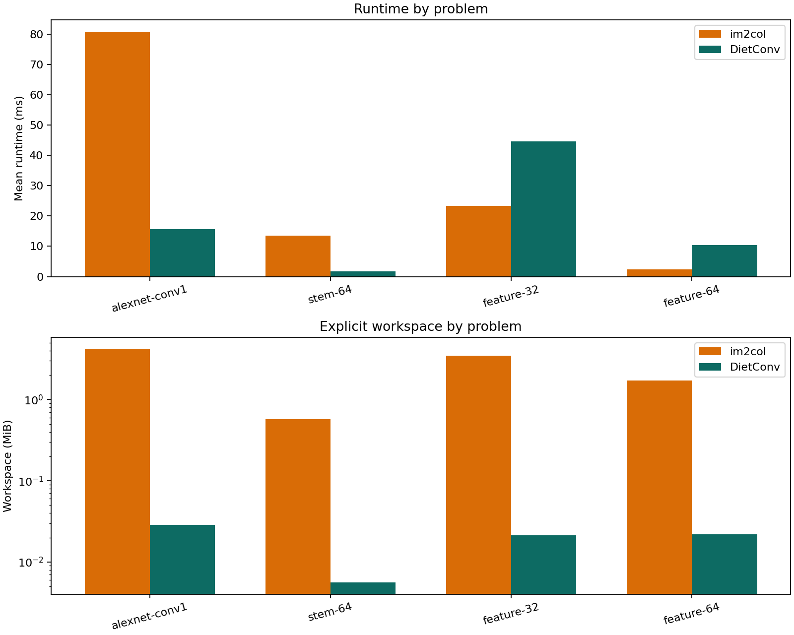
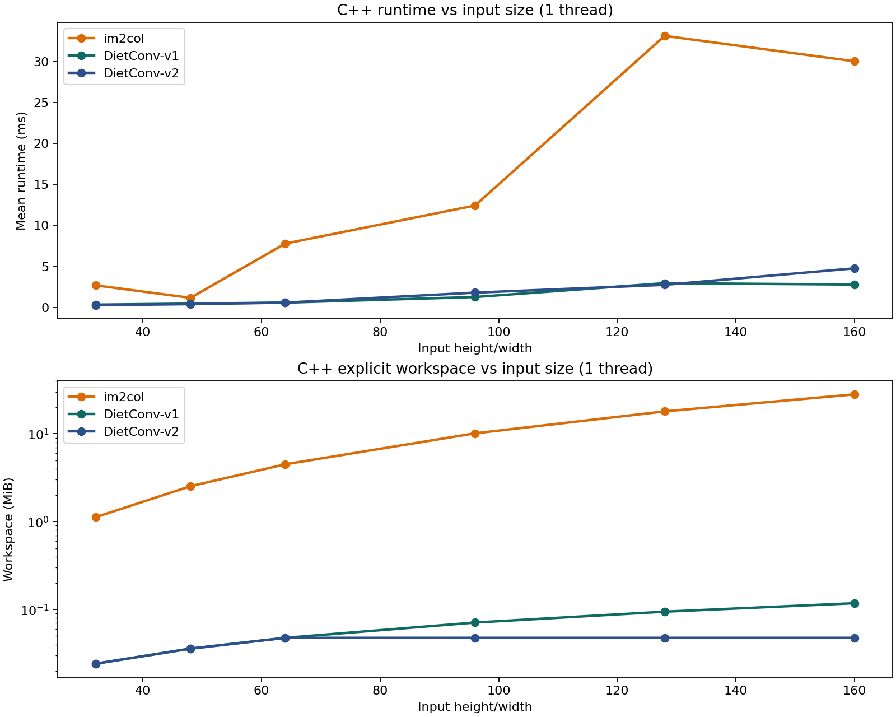
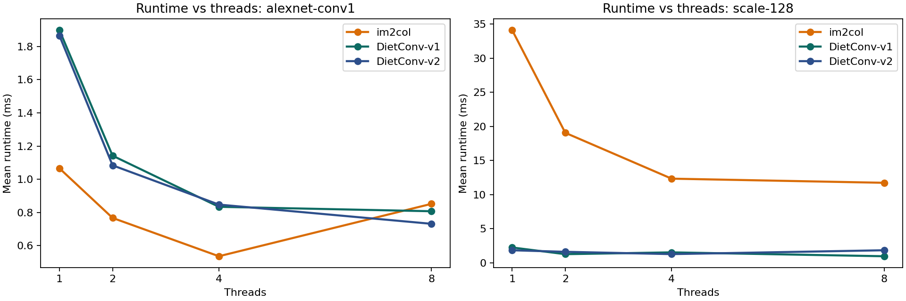
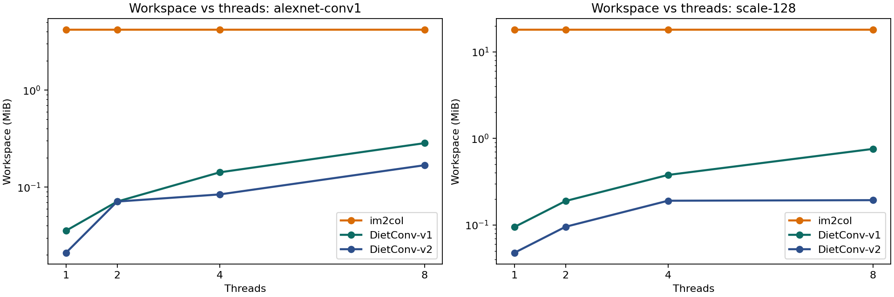
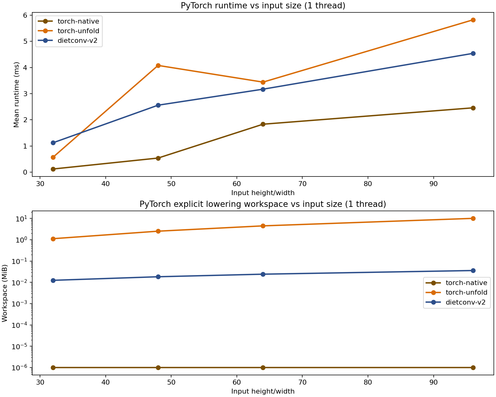
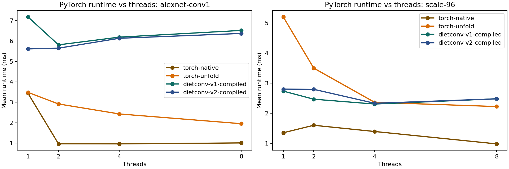
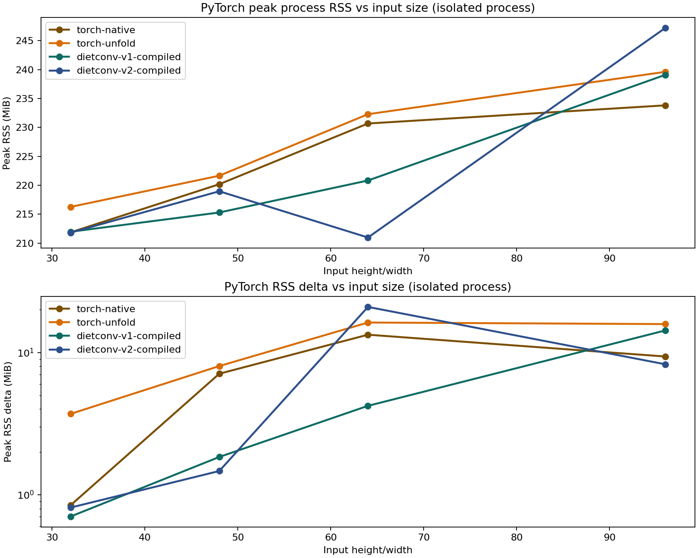
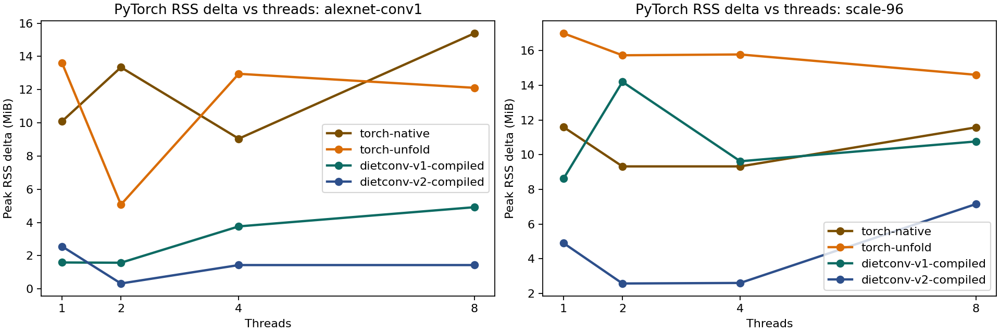

# DietConv Showcase

This repository recreates the central idea from the 2016 Carnegie Mellon poster: keep the GEMM-friendly structure of fast convolution, but avoid materializing the full `im2col` workspace used by Caffe-style convolution.

## Poster gist

The poster describes a middle ground between:

- textbook convolution, which has minimal extra memory but weak matrix-multiply reuse
- Caffe's `im2col + GEMM`, which is fast because it turns convolution into one large matrix multiply, but duplicates every overlapping patch

DietConv keeps the GEMM reduction, but only materializes a narrow temporary strip for one output row at a time. For each output row:

1. Copy an `F`-row strip of the input image into a temporary buffer.
2. Reorder filters by kernel-column so each kernel slice can be multiplied against that strip.
3. Accumulate `F` smaller GEMMs instead of one giant GEMM over the full `im2col` matrix.

That changes the explicit workspace from:

- `im2col`: `C * Fh * Fw * Hout * Wout`
- DietConv strip buffer: `C * Fh * Win`

For an AlexNet-style first layer (`3 x 227 x 227`, `96` filters, `11 x 11`, stride `4`), this is:

- `im2col`: `1,098,075` floats, about `4.19 MiB`
- DietConv: `7,491` floats, about `0.03 MiB`
- workspace reduction: about `146.6x`

That lines up with the poster's claim that the biggest win is memory and data duplication, not a fundamentally different arithmetic count.

## What's in the repo

- `dietconv/algorithms.py`: direct, `im2col`, and DietConv-style convolution kernels in NumPy
- `dietconv/torch_ops.py`: PyTorch `unfold` and DietConv v2 operators for CPU benchmarks
- `scripts/run_benchmarks.py`: generates CSV and JSON benchmark summaries
- `scripts/plot_benchmarks.py`: turns benchmark CSV output into a chart
- `scripts/showcase_cnn.py`: runs a small 3-layer CNN forward pass with both backends
- `cpp/dietconv_benchmark.cpp`: lower-level C++ benchmark driver using Accelerate `sgemm`
- `cpp/torch_dietconv_extension.cpp`: compiled CPU PyTorch extension for DietConv v1 and v2
- `scripts/run_cpp_benchmarks.py`: builds and runs size-scaling and thread-scaling C++ sweeps
- `scripts/plot_cpp_benchmarks.py`: generates plots for the C++ sweeps
- `scripts/run_torch_benchmarks.py`: runs CPU PyTorch benchmarks against native `conv2d`, explicit `unfold`, and DietConv v2
- `scripts/plot_torch_benchmarks.py`: generates plots for the PyTorch sweeps
- `scripts/run_torch_memory_benchmarks.py`: measures isolated-process peak RSS for the PyTorch backends
- `scripts/plot_torch_memory_benchmarks.py`: generates plots for the PyTorch process-memory sweeps
- `tests/test_algorithms.py`: correctness checks
- `tests/test_torch_ops.py`: PyTorch correctness checks

## Quick start

```bash
python3 -m unittest discover -s tests -p 'test_*.py'
python3 scripts/run_benchmarks.py --repeat 5 --warmup 1
python3 scripts/plot_benchmarks.py
python3 scripts/showcase_cnn.py
python3 scripts/run_cpp_benchmarks.py --repeat 3 --warmup 1
python3 scripts/plot_cpp_benchmarks.py
python3 scripts/run_torch_benchmarks.py --repeat 2 --warmup 1
python3 scripts/plot_torch_benchmarks.py
python3 scripts/run_torch_memory_benchmarks.py --repeat 2 --warmup 1
python3 scripts/plot_torch_memory_benchmarks.py
python3 scripts/update_readme_benchmarks.py
```

Results are written to `results/`. The benchmark, plot, and showcase scripts refresh the digest in this README automatically, and `scripts/update_readme_benchmarks.py` can be run manually if you only want to rebuild the report section.

<!-- BENCHMARK_DIGEST:START -->

## Benchmark digest

_This section is autogenerated from files in `results/` by `scripts/update_readme_benchmarks.py`._

How to read these results:

- Lower runtime is better. Lower workspace is better.
- `im2col` and `torch-unfold` are the duplication-heavy baselines.
- `v1` is the poster-faithful strip-buffer kernel. `v2` is the tiled strip-buffer variant.

### NumPy baseline

This is the simple reference showcase: easy to inspect, not the most meaningful performance layer.

| Problem | im2col ms | DietConv ms | im2col MiB | DietConv MiB | Workspace reduction |
| --- | --- | --- | --- | --- | --- |
| alexnet-conv1 | 80.76 | 15.59 | 4.189 | 0.029 | 146.6x |
| feature-32 | 23.40 | 44.59 | 3.445 | 0.021 | 162.2x |
| feature-64 | 2.41 | 10.39 | 1.723 | 0.022 | 78.4x |
| stem-64 | 13.55 | 1.74 | 0.574 | 0.006 | 102.4x |

- 3-layer CNN showcase peak workspace: `im2col 1.125 MiB` vs `DietConv 0.012 MiB`.
- CNN showcase workspace reduction: `90.4x` with checksum diff `0.0`.



### C++ benchmark digest

- On the 1-thread size sweep, `v2` beats `v1` on `5` of `6` tested sizes.
- Best `v2` speedup over `v1`: `32x32` input at `2.04x`.
- Largest `im2col` to `v2` workspace reduction in this sweep: `160x160` input at `590.8x`.
- The C++ path is the clearest view of the algorithm itself because it strips out most Python overhead.

| Input size | Fastest | im2col ms | v1 ms | v2 ms | v2 vs v1 | v1 MiB | v2 MiB | im2col/v2 ws |
| --- | --- | --- | --- | --- | --- | --- | --- | --- |
| 32 | v2 | 1.79 | 0.37 | 0.18 | 2.0x | 0.024 | 0.012 | 90.4x |
| 48 | v2 | 1.11 | 0.62 | 0.46 | 1.3x | 0.036 | 0.018 | 138.2x |
| 64 | v2 | 11.16 | 0.74 | 0.59 | 1.3x | 0.048 | 0.024 | 186.2x |
| 96 | v2 | 13.93 | 1.39 | 1.36 | 1.0x | 0.071 | 0.036 | 282.1x |
| 128 | v2 | 39.54 | 2.58 | 2.41 | 1.1x | 0.094 | 0.048 | 378.1x |
| 160 | v1 | 32.18 | 3.19 | 3.59 | 0.9x | 0.118 | 0.048 | 590.8x |

**Thread sweep: `alexnet-conv1`**

- `v2` beats `v1` on `3` of `4` tested thread counts.

| Threads | Fastest | im2col ms | v1 ms | v2 ms | v1 MiB | v2 MiB |
| --- | --- | --- | --- | --- | --- | --- |
| 1 | im2col | 1.07 | 1.90 | 1.87 | 0.035 | 0.021 |
| 2 | im2col | 0.77 | 1.14 | 1.08 | 0.071 | 0.071 |
| 4 | im2col | 0.54 | 0.83 | 0.85 | 0.142 | 0.084 |
| 8 | v2 | 0.85 | 0.81 | 0.73 | 0.284 | 0.168 |

**Thread sweep: `scale-128`**

- `v2` beats `v1` on `2` of `4` tested thread counts.

| Threads | Fastest | im2col ms | v1 ms | v2 ms | v1 MiB | v2 MiB |
| --- | --- | --- | --- | --- | --- | --- |
| 1 | v2 | 34.10 | 2.24 | 1.83 | 0.094 | 0.048 |
| 2 | v1 | 19.05 | 1.26 | 1.60 | 0.189 | 0.095 |
| 4 | v2 | 12.33 | 1.52 | 1.27 | 0.378 | 0.190 |
| 8 | v1 | 11.72 | 0.95 | 1.83 | 0.756 | 0.193 |







### PyTorch benchmark digest

- On the 1-thread size sweep, compiled `v2` beats compiled `v1` on `3` of `4` tested sizes.
- Compiled `v2` beats explicit `torch-unfold` on `4` of `4` tested sizes.
- The torch digest is the practical framework story: native `conv2d`, explicit `unfold`, and compiled DietConv side by side.

| Input size | Fastest | native ms | unfold ms | v1 ms | v2 ms | v2 vs v1 | v2 MiB |
| --- | --- | --- | --- | --- | --- | --- | --- |
| 32 | native | 0.11 | 0.59 | 0.16 | 0.15 | 1.1x | 0.012 |
| 48 | native | 0.37 | 1.28 | 0.41 | 0.42 | 1.0x | 0.018 |
| 64 | v2 | 1.55 | 2.54 | 1.12 | 0.81 | 1.4x | 0.024 |
| 96 | v2 | 1.63 | 8.93 | 1.82 | 1.41 | 1.3x | 0.024 |

- Numeric guardrail: current worst torch max-abs diff vs native `conv2d` is `9.53674e-05`.

**Thread sweep: `alexnet-conv1`**

- Compiled `v2` beats compiled `v1` on `1` of `4` tested thread counts.

| Threads | Fastest | native ms | unfold ms | v1 ms | v2 ms |
| --- | --- | --- | --- | --- | --- |
| 1 | unfold | 2.15 | 1.67 | 1.87 | 1.94 |
| 2 | native | 1.00 | 1.54 | 1.81 | 1.94 |
| 4 | native | 0.82 | 1.02 | 1.95 | 1.90 |
| 8 | unfold | 1.33 | 0.81 | 1.94 | 1.98 |

**Thread sweep: `scale-96`**

- Compiled `v2` beats compiled `v1` on `0` of `4` tested thread counts.

| Threads | Fastest | native ms | unfold ms | v1 ms | v2 ms |
| --- | --- | --- | --- | --- | --- |
| 1 | v1 | 1.15 | 4.24 | 1.14 | 1.52 |
| 2 | v1 | 1.24 | 3.36 | 1.18 | 1.25 |
| 4 | native | 0.99 | 3.58 | 1.42 | 1.43 |
| 8 | native | 1.15 | 2.71 | 1.47 | 1.48 |





### PyTorch measured memory digest

- This section reports isolated-process peak RSS deltas, not just theoretical lowering workspace.
- Lower is better. Unlike the workspace table, `torch-native` now has a real measured memory number.
- The numbers are sampled process-memory deltas above a worker's post-setup baseline, so treat them as practical RSS estimates rather than exact allocator totals.

| Input size | native RSS delta | unfold RSS delta | v1 RSS delta | v2 RSS delta | Lowest delta |
| --- | --- | --- | --- | --- | --- |
| 32 | 0.844 | 3.703 | 0.703 | 0.812 | v1 |
| 48 | 7.094 | 8.031 | 1.844 | 1.469 | v2 |
| 64 | 13.344 | 16.250 | 4.219 | 20.922 | v1 |
| 96 | 9.375 | 15.844 | 14.297 | 8.266 | v2 |

**Memory thread sweep: `alexnet-conv1`**

| Threads | native RSS delta | unfold RSS delta | v1 RSS delta | v2 RSS delta | Lowest delta |
| --- | --- | --- | --- | --- | --- |
| 1 | 10.094 | 13.609 | 1.594 | 2.562 | v1 |
| 2 | 13.344 | 5.078 | 1.578 | 0.328 | v2 |
| 4 | 9.047 | 12.953 | 3.766 | 1.438 | v2 |
| 8 | 15.391 | 12.109 | 4.922 | 1.438 | v2 |

**Memory thread sweep: `scale-96`**

| Threads | native RSS delta | unfold RSS delta | v1 RSS delta | v2 RSS delta | Lowest delta |
| --- | --- | --- | --- | --- | --- |
| 1 | 11.594 | 17.000 | 8.625 | 4.906 | v2 |
| 2 | 9.328 | 15.734 | 14.203 | 2.578 | v2 |
| 4 | 9.328 | 15.781 | 9.625 | 2.609 | v2 |
| 8 | 11.578 | 14.609 | 10.766 | 7.156 | v2 |





<!-- BENCHMARK_DIGEST:END -->

## DietConv v2

DietConv v1 is the direct strip-buffer interpretation of the poster: copy a full `Fh x Win` input strip for each output row, then run one GEMM per kernel column.

DietConv v2 adds one more idea:

- tile the output width and only pack the input span needed for that tile
- reuse the packed tile window across adjacent output rows in the lower-level C++ implementation
- feed GEMM directly from the tiled window on stride-`1` cases instead of repacking a second strip matrix
- autotune the output tile width during C++ and PyTorch benchmark sweeps, then choose the smallest workspace within `5%` of the fastest timing
- keep a smaller per-thread lowering buffer so memory grows more slowly with thread count

Tradeoffs:

- v2 usually lowers workspace further than v1
- v2 is now clearly faster than v1 on most of the stride-`1` size sweep in the C++ benchmark, but it can still lose on very wide cases or under some thread counts
- v2 can still be slower when tiling causes too much repeated packing across the width dimension or when the chosen tile width is not ideal for a specific thread count

## Notes on fidelity

This is a benchmark-and-explanation repository, not a production kernel:

- the implementation is CPU-only and uses NumPy BLAS
- the lower-level benchmark path is C++ plus Apple's Accelerate BLAS on macOS
- the PyTorch path is now a CPU-only compiled extension plus Python wrappers; it still does not implement backward passes or GPU kernels
- the torch benchmarks are inference-oriented and benefit from weight prepacking outside the timed region
- the direct kernel is for correctness, not performance
- the DietConv kernel mirrors the strip-buffer structure from the poster
- DietConv v2 is a practical enhancement, not something claimed in the original poster
- the memory advantage is structural and shows up consistently; the runtime advantage depends on the problem shape and how well NumPy's BLAS path handles one large GEMM versus several smaller ones
- for stride greater than `1`, the NumPy implementation still makes a compact contiguous slice per GEMM so `@` can consume it efficiently

## Next steps

- Improve the compiled torch extension so it scales better with thread count on AlexNet-style large-kernel layers and batch sizes greater than `1`.
- Extend the optimized torch path with persistent module-level prepacking for more realistic repeated-inference or fine-tuning scenarios beyond the benchmark harness.
- Improve v2 autotuning so tile width adapts to thread count and problem shape more reliably; the current torch and C++ results still show cases where v2 leaves performance on the table.
- Add thread-scaling experiments that separate arithmetic time from packing time, so it is clearer when v2 wins because of cache reuse versus because of reduced memory traffic.
- Expand the benchmark suite with more CNN-relevant layer shapes from AlexNet, VGG, ResNet, and MobileNet to show where strip-buffer convolution helps most and where large monolithic GEMMs still dominate.
- Separate theoretical workspace from measured process memory so the repository can report both the structural duplication reduction and the real end-to-end peak RSS seen during runs.
- Add a PyTorch inference showcase that swaps a few convolution layers between native `conv2d`, `unfold`-style lowering, and DietConv-style strip buffering while preserving numerics, so the repo demonstrates the idea inside a recognizable model.
- Document the exact correspondence between the poster pseudocode and the implementation, including filter reordering, temporary-buffer layout, and how stride affects the copied strip.
